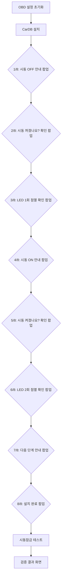
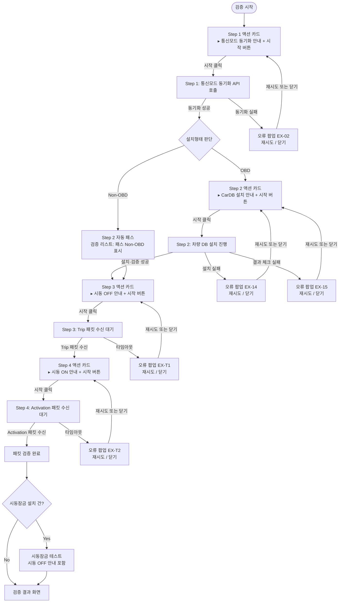
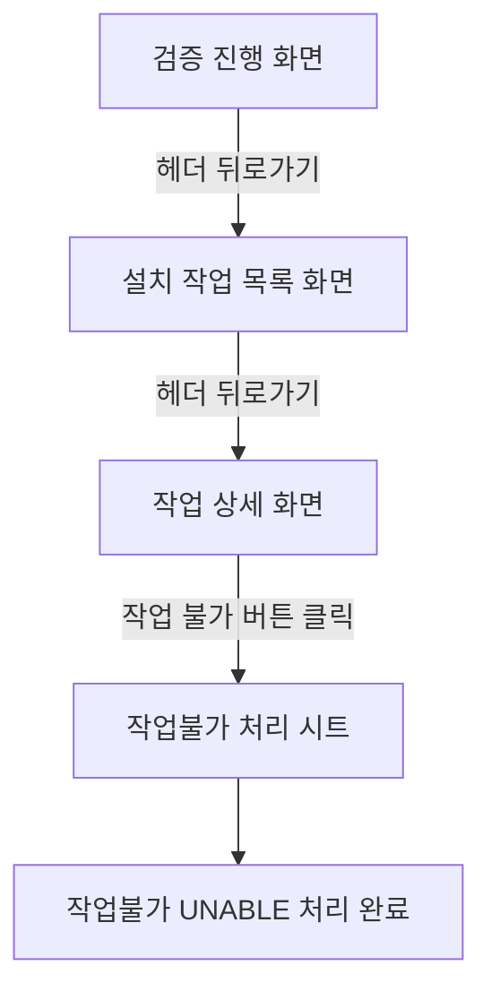

# [현장서비스 개선] 인스톨러앱 — 검증 프로세스 PRD v1.2

> **문서 성격**: 본 문서는 인스톨러앱 검증 프로세스를 독립적으로 정의한 명세서이다. 기존 메인 PRD(`PRD_인스톨러앱_20260428_v5.8.md`)의 §5.1.6 및 BR-24를 본 문서의 내용으로 교체·갱신해야 한다.

> **변경 이력**
> - v1.2 (2026-05-13): Gap 분석 기반 전면 보완.
>   ① **Step 1 명칭 변경** — 'OBD 설정 초기화' → '통신모드 동기화 (OBD/Non-OBD)'. OBD 설정 초기화가 기존 설정 페이지의 [Non-OBD 호출]과 동일 기능임이 확인됨. 설정 페이지 [Non-OBD 호출] 버튼 삭제 결정 반영.
>   ② **Non-OBD 검증 재설계** — Step 2(차량 DB 설치)만 자동 패스, Step 1·3·4는 OBD와 동일 진행. 시동 순서도 OFF→ON으로 통일(기존 Non-OBD ON→OFF 폐지). §3.3 독립 상세 명세로 전면 재작성.
>   ③ **재검증 정책 명시** — 재검증 시 Step 1부터 전체 단계 처음부터 재진행 (§3.5 보완).
>   ④ **§3.6 신설** — 임시 등록 차량 검증 진입 불가 조건 명시.
> - v1.1 (2026-05-11): HTML 프로토타입 v1.3 기반 업데이트. ① OBD Step 1·2 자동 진행 → 수동 실행(액션 카드 + `[시작]` 버튼) 방식으로 변경. ② 오류 팝업 버튼 `[재시도]` `[작업 불가]` → `[재시도]` `[닫기]`로 변경. ③ §3.5 검증 중 작업 불가 처리 흐름 전면 재정의 — 뒤로가기 경로로 통일.
> - v1.0 (2026-05-11): 신규 작성. 260511 인스톨러 검증 프로세스 미팅 결정사항 기반. OBD 모드 8단계 → 4단계 재설계(LED 이미지 제거, 실제 패킷 수신 기반 검증 전환).

---

## 1. 개요 (Overview)

### 1.1 문서 목적

본 PRD는 인스톨러앱의 **검증 단계(§5.1.6에 해당하는 영역)**를 독립적으로 정의한다. 기존 프로세스의 구조적 문제를 해소하고, 실제 서버 패킷 수신 여부를 기반으로 한 검증 체계로 전환하는 것이 목적이다.

- **적용 범위**: 설치 플로우 및 AS 플로우 공통 — 사진 증빙 완료 후 진입하는 **검증 단계 전체**
- **참조 기준 문서**: `PRD_인스톨러앱_20260428_v5.8.md` (이하 "메인 PRD")
- **연계 미팅 자료**: `01_Resources/260511 미팅/260511 인스톨러 검증 프로세스 미팅.txt`

### 1.2 변경 배경

| 문제 | 내용 |
| :--- | :--- |
| 가이드라인과 검증의 혼용 | 기존 8단계 운행 유효성 체크는 행동 지침 수준이며, 각 단계 사이에 API 호출 또는 패킷 검증이 없었다. |
| LED 이미지의 무의미성 | 단말기 모델·케이스 색상마다 LED 색상·점멸 패턴이 달라 기준 이미지로 확인을 요청하는 것은 실질적 의미가 없다. |
| 설치 완료 판단의 불명확성 | 기사가 "네" 버튼만 누르면 실제 패킷 수신 여부와 관계없이 설치 완료 처리될 수 있었다. |
| Non-OBD 호출 중복 | 기존 설정 페이지의 [Non-OBD 호출] 버튼이 OBD 설정 초기화(Step 1)와 동일한 기능을 수행함이 확인됨. Step 1에 통합하여 중복 제거. |

### 1.3 재설계 방향

1. **실제 패킷 수신 기반 검증**: Trip 패킷·Activation 패킷이 서버에 수신되었는지 시스템이 직접 확인한다.
2. **검증 단계 단순화**: OBD 모드 기존 8단계를 **4단계**로 줄인다.
3. **OBD·Non-OBD 검증 구조 통일**: OBD·Non-OBD 모두 동일한 4단계 구조를 따른다. Non-OBD는 Step 2(CarDB 설치)만 자동 패스한다.
4. **통신모드 동기화 통합**: 기존 설정 페이지의 [Non-OBD 호출] 기능을 Step 1에 통합한다.

---

## 2. AS-IS: 기존 OBD 검증 프로세스 (8단계)

> 현행 상태를 기록하여 변경 전/후를 명확히 구분한다.

**핵심 문제점**: 1/8~8/8 각 단계 사이에 서버 API 호출 없음. LED 이미지 기준 이미지와 불일치. 기사가 "네" 누르면 패킷 미수신 상태로도 완료 처리 가능.

---

## 3. TO-BE: 신규 검증 프로세스

### 3.1 전체 검증 플로우 (OBD · Non-OBD 통합)

---

### 3.2 공통 4단계 검증 상세

> OBD·Non-OBD 모두 동일한 4단계 구조를 따른다. Non-OBD는 Step 2만 자동 패스하며 나머지 단계는 동일하게 진행한다.

#### Step 1: 통신모드 동기화 (OBD/Non-OBD) — OBD·Non-OBD 공통

| 항목 | 내용 |
| :--- | :--- |
| 진입 시 UI | 액션 안내 카드 + `[시작]` 버튼 |
| 안내 텍스트 | "통신모드 동기화를 시작해 주세요. 준비 완료 후 `[시작]`을 눌러주세요." |
| `[시작]` 클릭 후 | 스피너 + "통신모드 동기화 진행 중… 잠시 기다려 주세요." (STAFF 어드민에 등록된 차량의 통신모드와 단말기의 통신모드 일치 API 호출) |
| 성공 시 (OBD) | Step 2 액션 카드 표시 |
| 성공 시 (Non-OBD) | Step 2 자동 패스 처리 후 Step 3 액션 카드 표시 |
| 실패 시 | EX-02 오류 팝업 표시 |
| 기능 정의 | STAFF 어드민에 등록된 해당 차량의 통신모드(OBD/Non-OBD)와 단말기의 통신모드를 일치(동기화)시키는 단계. 기존 설정 페이지의 [Non-OBD 호출] 버튼과 동일한 기능이며 본 단계에 통합됨. |

#### Step 2: 차량 DB 설치 (CarDB) — OBD 전용 / Non-OBD 자동 패스

| 항목 | 내용 |
| :--- | :--- |
| OBD — 진입 시 UI | 액션 안내 카드 + `[시작]` 버튼 |
| OBD — 안내 텍스트 | "차량 DB(CarDB) 설치를 시작해 주세요. OBD 포트 연결 상태 확인 후 `[시작]`을 눌러주세요." |
| OBD — `[시작]` 클릭 후 | 스피너 + "차량 DB 설치 중… 잠시 기다려 주세요." (CarDB 설치 API 호출) |
| OBD — 성공 시 | Step 3 액션 카드 표시 |
| OBD — 설치 실패 시 | EX-14 오류 팝업 표시 |
| OBD — 결과 체크 실패 시 | EX-15 오류 팝업 표시 |
| **Non-OBD** | **CarDB 설치 불필요. Step 1 성공 즉시 Step 2를 자동 패스하고 Step 3으로 진행. 검증 리스트에 "패스 (Non-OBD)" 표시.** |

#### Step 3: 시동 OFF — Trip 패킷 수신 — OBD·Non-OBD 공통

| 항목 | 내용 |
| :--- | :--- |
| 진입 시 UI | 액션 안내 카드 + `[시작]` 버튼 |
| 안내 텍스트 | "차량 시동을 꺼주세요. `[시작]` 버튼을 누르면 Trip 패킷 수신 대기를 시작합니다." |
| `[시작]` 클릭 후 | 스피너 + "Trip 패킷 수신 대기 중… 차량 시동이 완전히 꺼진 상태인지 확인해 주세요." |
| Trip 패킷 수신 시 | Step 4로 자동 진행. 성공 인디케이터 표시. |
| 타임아웃 시 | EX-T1 오류 팝업 표시 |

#### Step 4: 시동 ON — Activation 패킷 수신 — OBD·Non-OBD 공통

| 항목 | 내용 |
| :--- | :--- |
| 진입 시 UI | 액션 안내 카드 + `[시작]` 버튼 |
| 안내 텍스트 | "차량 시동을 켜주세요. `[시작]` 버튼을 누르면 Activation 패킷 수신 대기를 시작합니다." |
| `[시작]` 클릭 후 | 스피너 + "Activation 패킷 수신 대기 중… 차량 시동이 켜진 상태인지 확인해 주세요." |
| Activation 패킷 수신 시 | 패킷 검증 완료. 시동잠금 테스트 또는 검증 결과 화면으로 진행. |
| 타임아웃 시 | EX-T2 오류 팝업 표시 |

---

### 3.3 Non-OBD 모드 검증 상세

Non-OBD 차량의 검증은 OBD와 동일한 4단계 구조를 따른다. 차이는 Step 2(CarDB 설치) 자동 패스 하나뿐이다.

| 단계 | Non-OBD 처리 |
| :--- | :--- |
| Step 1: 통신모드 동기화 | **동일 실행**. STAFF 어드민 차량 통신모드와 단말기 통신모드를 Non-OBD로 동기화. |
| Step 2: 차량 DB 설치 | **자동 패스**. CarDB 불필요. Step 1 성공 즉시 검증 리스트에 "패스 (Non-OBD)" 표시 후 Step 3으로 자동 진행. 기사 조작 없음. |
| Step 3: 시동 OFF — Trip 패킷 | **동일 실행**. |
| Step 4: 시동 ON — Activation 패킷 | **동일 실행**. |

**시동 순서**: OBD와 동일하게 **시동 OFF(Trip) → 시동 ON(Activation)** 순서로 진행한다.

> **v1.2 변경사항**: 기존 Non-OBD는 시동 ON(Activation) → 시동 OFF(Trip) 순서였다. v1.2에서 OBD와 통일하여 시동 OFF → ON 순서로 변경한다. 기존 EX-12(시동 ON 타임아웃)·EX-13(시동 OFF 타임아웃)은 EX-T1·EX-T2로 통합한다.

**Non-OBD 진입 배너**: 검증 화면 최상단에 고정 배너를 표시한다.
> "Non-OBD 모드 검증 — Step 2(차량 DB 설치)는 자동 패스됩니다. 나머지 단계는 OBD 모드와 동일하게 진행해 주세요."

---

### 3.4 시동잠금 테스트

패킷 검증 완료 후 **시동잠금 설치 건**에 한해 시동잠금 테스트를 진행한다. OBD·Non-OBD 공통 적용.

| 항목 | 내용 |
| :--- | :--- |
| 진입 조건 | 시동잠금 설치 여부 = `설치` (어드민 신청값 기준, 읽기 전용) |
| 진입 시 안내 | 섹션 최상단에 "시동잠금 테스트를 위해 차량 시동을 꺼주세요." 문구 표시. Step 4(시동 ON) 완료 직후이므로 기사가 시동 OFF 필요성을 인지할 수 있도록 안내. |
| 인라인 배너 | `[시동잠금]` 버튼 상단: "차량 시동이 완전히 꺼진 상태에서 버튼을 눌러 주세요. 잠금 → 해제 순서로 테스트가 자동 진행됩니다." |
| 테스트 진행 순서 | ① `[시동잠금]` 클릭 → ② 기사 확인 후 `[확인 완료]` → ③ `[시동잠금 해제]` 활성화 → ④ 해제 명령 전송 → ⑤ 기사 확인 후 `[확인 완료]` → 검증 결과 진행 |
| 실패 시 (EX-05) | 오류 팝업 표시. `[재시도]` 클릭 시 시동잠금 테스트 섹션만 초기화하여 재진행. OBD 패킷 단계 재수행 없음. |

---

### 3.5 검증 오류 발생 시 처리 방법

검증 단계(Step 1~4, 시동잠금 테스트) 오류 팝업은 `[재시도]`와 `[닫기]` 버튼만 제공한다. **검증 오류 팝업에서 `[작업 불가]`를 직접 선택하는 경로는 존재하지 않는다.**

#### [닫기] 버튼 동작

오류 팝업의 `[닫기]`를 클릭하면 팝업이 닫히고, 오류가 발생한 Step의 **액션 카드가 다시 표시**된다. (`[재시도]` 클릭과 동일한 결과 상태)

#### [작업 불가] 처리 경로

#### 재검증 처리

| 항목 | 내용 |
| :--- | :--- |
| 재검증 진입 조건 | 검증 결과 화면에서 단말기 전원연결·시동감지·시동잠금 제어 중 하나라도 비정상 (메인 PRD BR-22 기준) |
| 재검증 재시작 기준 | **Step 1(통신모드 동기화)부터 전체 단계를 처음부터 재진행**한다. 중간 단계부터 재시작하지 않는다. |
| 재검증 횟수 제한 | 최대 5회. 5회 소진 시 `[재검증]` 버튼 비노출 + 안내 메시지 표시 (메인 PRD BR-22 기준). |
| EX-05 재시도 | 시동잠금 테스트 실패 재시도는 시동잠금 섹션만 초기화. OBD 패킷 단계 재수행 없음. (재검증 카운터 미증가) |

---

### 3.6 임시 등록 차량 검증 진입 불가

임시 등록 차량(차량번호 `00000000`)은 검증 단계에 진입할 수 없다.

| 항목 | 내용 |
| :--- | :--- |
| 차단 시점 | 작업 상세 화면에서 `[작업 시작]` 클릭 시 |
| 차단 방식 | 안내 팝업 출력 후 진행 차단. "해당 차량은 카코드 확인이 필요합니다. 운영팀에 차대번호를 전달하고 문의해 주세요." |
| 해제 조건 | 운영팀이 정상 차량으로 교체 완료 후, 기사가 작업 목록을 새로고침하여 재진입 |
| 근거 | 메인 PRD EX-09 / BR-16 |

---

## 4. 팝업 및 UX 명세

### 4.1 공통 — 인라인 UI 전체 명세

| 단계 | UI 유형 | 내용 |
| :--- | :--- | :--- |
| Step 1 진입 시 | 액션 안내 카드 + `[시작]` 버튼 | "통신모드 동기화를 시작해 주세요. 준비 완료 후 `[시작]`을 눌러주세요." |
| Step 1 `[시작]` 후 | 인라인 스피너 + 텍스트 | "통신모드 동기화 진행 중… 잠시 기다려 주세요." |
| Step 2 진입 시 (OBD) | 액션 안내 카드 + `[시작]` 버튼 | "차량 DB(CarDB) 설치를 시작해 주세요. OBD 포트 연결 상태 확인 후 `[시작]`을 눌러주세요." |
| Step 2 `[시작]` 후 (OBD) | 인라인 스피너 + 텍스트 | "차량 DB 설치 중… 잠시 기다려 주세요." |
| Step 2 자동 패스 (Non-OBD) | 인라인 처리 (기사 조작 없음) | 검증 리스트에 "패스 (Non-OBD)" 표시 후 Step 3 카드 자동 표시 |
| Step 3 진입 시 | 액션 안내 카드 + `[시작]` 버튼 | "차량 시동을 꺼주세요. `[시작]` 버튼을 누르면 Trip 패킷 수신 대기를 시작합니다." |
| Step 3 `[시작]` 후 | 인라인 스피너 + 텍스트 | "Trip 패킷 수신 대기 중… 차량 시동이 완전히 꺼진 상태인지 확인해 주세요." |
| Step 4 진입 시 | 액션 안내 카드 + `[시작]` 버튼 | "차량 시동을 켜주세요. `[시작]` 버튼을 누르면 Activation 패킷 수신 대기를 시작합니다." |
| Step 4 `[시작]` 후 | 인라인 스피너 + 텍스트 | "Activation 패킷 수신 대기 중… 차량 시동이 켜진 상태인지 확인해 주세요." |
| 시동잠금 테스트 직전 | 인라인 안내 텍스트 | "시동잠금 테스트를 위해 차량 시동을 꺼주세요." |
| 시동잠금 테스트 버튼 상단 | 인라인 배너 (항상 노출) | "차량 시동이 완전히 꺼진 상태에서 버튼을 눌러 주세요. 잠금 → 해제 순서로 테스트가 자동 진행됩니다." |

### 4.2 오류 팝업 전체 명세

| 팝업 ID | 발생 시점 | 제목 | 본문 | 버튼 |
| :--- | :--- | :--- | :--- | :--- |
| EX-02 | Step 1 통신모드 동기화 실패 (OBD·Non-OBD 공통) | "통신모드 동기화 실패" | "통신모드 동기화에 실패했습니다. 단말기 연결 상태를 확인하고 재시도해 주세요." | `[재시도]` `[닫기]` |
| EX-14 | Step 2 CarDB 설치 실패 (OBD 전용) | "차량 DB 설치 실패" | "차량 DB(CarDB) 설치에 실패했습니다. OBD 포트 연결 상태를 확인해 주세요." | `[재시도]` `[닫기]` |
| EX-15 | Step 2 CarDB 결과 체크 실패 (OBD 전용) | "차량 DB 검증 실패" | "차량 DB 설치 결과가 정상이 아닙니다. 단말기 연결 상태를 재확인해 주세요." | `[재시도]` `[닫기]` |
| EX-T1 | Step 3 Trip 패킷 타임아웃 (OBD·Non-OBD 공통) | "시동 OFF가 감지되지 않습니다" | "Trip 패킷이 수신되지 않았습니다. 차량 시동이 완전히 꺼진 상태인지 확인하고 재시도해 주세요." | `[재시도]` `[닫기]` |
| EX-T2 | Step 4 Activation 패킷 타임아웃 (OBD·Non-OBD 공통) | "시동이 감지되지 않습니다" | "Activation 패킷이 수신되지 않았습니다. 차량 시동이 켜진 상태인지 확인하고 재시도해 주세요." | `[재시도]` `[닫기]` |
| EX-05 | 시동잠금 테스트 실패 (OBD·Non-OBD 공통) | "시동잠금 테스트 실패" | "시동잠금 제어에 실패했습니다. ① 차량 시동이 완전히 꺼진 상태인지 확인 ② ACC 모드(반시동)가 아닌지 확인 ③ 시동 OFF 후 최소 5초가 경과했는지 확인\n\n반복 실패 시 뒤로 돌아가 작업 상세 화면의 [작업 불가]를 처리해 주세요." | `[재시도]` |
| EX-09 | 임시 등록 차량 [작업 시작] 클릭 시 | "임시 등록 차량" | "해당 차량은 카코드 확인이 필요합니다. 운영팀에 차대번호를 전달하고 문의해 주세요. 운영팀이 정상 차량으로 교체 완료 후 작업 목록을 새로고침하여 진행해 주세요." | `[확인]` |

> **오류 팝업 공통 규칙**:
> - `[재시도]`: 해당 오류가 발생한 Step 액션 카드를 다시 표시한다. 이미 성공한 상위 단계는 재수행하지 않는다.
>   - EX-02 → Step 1 카드, EX-14·EX-15 → Step 2 카드, EX-T1 → Step 3 카드, EX-T2 → Step 4 카드
>   - EX-05 → 시동잠금 테스트 섹션만 초기화 후 재진행. OBD 패킷 단계 재수행 없음.
> - `[닫기]` (EX-02·EX-14·EX-15·EX-T1·EX-T2): 팝업 닫고 해당 Step 액션 카드 재표시. (`[재시도]`와 동일)
> - **EX-05는 `[닫기]` 버튼을 제공하지 않는다.**
> - **EX-12·EX-13은 EX-T1·EX-T2로 통합됨** (v1.2). Non-OBD 시동 순서 통일로 별도 구분 불필요.
> - 패킷 수신 대기 타임아웃 임계값은 개발 명세서에서 정의. 본 PRD 범위 외.

---

## 5. 기존 OBD 검증과 신규 검증 — 단계별 대조표

| 기존 단계 | 기존 내용 | 신규 단계 | 신규 내용 | 처리 |
| :--- | :--- | :--- | :--- | :--- |
| OBD 설정 초기화 | 서버 초기화 API | Step 1: 통신모드 동기화 | OBD·Non-OBD 통신모드 동기화 API. [Non-OBD 호출] 기능 통합. | **변경** |
| CarDB 설치 | CarDB 설치 API | Step 2: CarDB 설치 | OBD 동일. Non-OBD는 자동 패스. | **변경 (Non-OBD)** |
| 1/8: 시동 OFF 안내 팝업 | 가이드라인 | Step 3: 시동 OFF 안내 카드 | 카드 + [시작] + 실제 Trip 패킷 수신 | **대체** |
| 2/8: 꺼졌나요? 확인 팝업 | 기사 수동 확인 | — | Trip 패킷 수신으로 대체 | **제거** |
| 3/8: LED 1회 점멸 확인 (이미지) | LED 육안 확인 | — | 제거 | **제거** |
| 4/8: 시동 ON 안내 팝업 | 가이드라인 | Step 4: 시동 ON 안내 카드 | 카드 + [시작] + 실제 Activation 패킷 수신 | **대체** |
| 5/8~7/8 팝업 3개 | 기사 수동 확인 | — | 패킷 수신으로 대체 | **제거** |
| 8/8: 설치 완료 팝업 | 완료 팝업 | — | 검증 결과 화면에서 통합 표시 | **이동** |
| 시동잠금 테스트 | 시동잠금 설치 건 한정 | 시동잠금 테스트 | 동일 + "시동 꺼주세요" 안내 추가 | **유지 + 강화** |
| [Non-OBD 호출] (설정 페이지) | Non-OBD 모드 변환 버튼 | Step 1 통신모드 동기화 | 동일 기능 통합 | **삭제 → Step 1 통합** |

---

## 6. 비즈니스 규칙 변경사항

### BR-24 (v1.2 개정)

**OBD·Non-OBD 모두 동일한 4단계 구조로 검증을 진행하며, 각 단계별 액션 카드 + `[시작]` 버튼 UI를 의무적으로 표시한다. 모든 단계는 기사가 `[시작]`을 직접 눌러 수동으로 실행한다.**

1. **Step 1 — 통신모드 동기화 (공통)**: 액션 카드 + `[시작]` 버튼. 성공 시 Step 2 진행, 실패 시 EX-02.
2. **Step 2 — 차량 DB 설치**:
   - OBD: 액션 카드 + `[시작]` 버튼. 성공 시 Step 3 진행, 실패 시 EX-14/EX-15.
   - Non-OBD: 자동 패스. 검증 리스트에 "패스 (Non-OBD)" 표시 후 Step 3 자동 진행.
3. **Step 3 — 시동 OFF Trip 패킷 수신 (공통)**: 액션 카드 + `[시작]`. 수신 시 Step 4 진행, 타임아웃 시 EX-T1.
4. **Step 4 — 시동 ON Activation 패킷 수신 (공통)**: 액션 카드 + `[시작]`. 수신 시 검증 완료, 타임아웃 시 EX-T2.

**시동 순서는 OBD·Non-OBD 모두 OFF(Trip) → ON(Activation) 순서로 통일한다.**

**기존 8단계 운행 패킷 유효성 체크(1/8~8/8)는 폐지. LED 점멸 이미지 팝업 및 기사 수동 확인 팝업은 표시하지 않는다.**

**설정 페이지의 [Non-OBD 호출] 버튼은 삭제한다. 해당 기능은 Step 1(통신모드 동기화)에 통합됨.** (메인 PRD BR-15·BR-21·EX-11 폐지)

---

## 7. 메인 PRD 업데이트 필요 사항

| 대상 섹션 | 변경 내용 |
| :--- | :--- |
| §5.1.4 설정 페이지 | [Non-OBD 호출] 버튼 삭제 |
| §5.1.6 검증 단계 OBD 모드 | 기존 8단계 → 본 문서 §3.2 4단계로 교체 |
| §5.1.6 검증 단계 Non-OBD 모드 | 별도 분기 제거. §3.3 내용으로 교체. |
| §4 예외 처리 EX-02 | 제목 "단말기 초기화 실패" → "통신모드 동기화 실패" |
| §4 예외 처리 EX-11 | 폐지 ([Non-OBD 호출] 삭제) |
| §4 예외 처리 EX-12·EX-13 | 폐지. EX-T1·EX-T2로 통합. |
| §4 예외 처리 EX-T1·EX-T2 (신규) | OBD·Non-OBD 공통 타임아웃 팝업 |
| BR-15·BR-21 | 폐지 ([Non-OBD 호출] 버튼 삭제에 따라) |
| BR-16 | Non-OBD 호출 관련 내용 제거 |
| BR-24 | 본 문서 §6 개정 내용으로 교체 |

---

## 8. 미결 사항 (TBD)

| ID | 항목 | 상태 |
| :--- | :--- | :--- |
| TBD-V1 | EX-T1, EX-T2 패킷 수신 대기 타임아웃 임계값 (초) | 개발 명세서에서 정의 예정. PRD 범위 외. |
| TBD-V2 | Step 1·2 진행 상황 폴링 방식 (서버 응답 대기 vs 고정 대기 시간) | 개발 명세서에서 정의 예정. |
| TBD-V3 | CAMD3000 시리즈 2포트 — 온도계 포트 정상 작동 확인 항목 추가 여부 | 케이스 발생 시 검토. |

---

## 9. 메인 PRD(v5.8) 교차 검증 — 충돌/누락/신규 항목

### 9-A. 충돌 항목 (본 문서 내용이 우선)

| ID | 대상 | 메인 PRD(v5.8) | 본 문서 변경 | 비고 |
| :--- | :--- | :--- | :--- | :--- |
| C-01 | §5.1.6 OBD 검증 절차 | 8단계 | 4단계 축소. 패킷 수신 기반 전환. | §3.2 참조 |
| C-02 | §5.1.6 Non-OBD 검증 분기 | ON→OFF 순서, 별도 UI | OFF→ON 통일. OBD와 동일 4단계 UI. | §3.3 참조 |
| C-03 | EX-12·EX-13 | Non-OBD 전용 타임아웃 팝업. `[작업 불가]` 버튼 포함. | EX-T1·EX-T2로 통합. `[닫기]` 버튼으로 변경. | §4.2 참조 |
| C-04 | EX-11 | Non-OBD 호출 미완료 차단 | [Non-OBD 호출] 삭제로 폐지 | §6 BR-24 참조 |
| C-05 | BR-15·BR-21 | [Non-OBD 호출] 노출 조건·[다음] 비활성화 | [Non-OBD 호출] 삭제로 폐지 | §6 BR-24 참조 |
| C-06 | BR-24 | 8단계 의무 표시, Non-OBD 별도 분기 | 4단계 통일 구조, Non-OBD Step 2만 패스 | §6 참조 |

### 9-B. 메인 PRD 정책 그대로 유효

| ID | 대상 | 처리 |
| :--- | :--- | :--- |
| O-01 | 검증 결과 화면 11항목 | 메인 PRD §5.1.6 기준 유지. 결과 항목 구성 변경 없음. |
| O-02 | 재검증 BR-22 (5회 제한) | 메인 PRD BR-22 기준 유지. 단, 재시작 기준은 본 문서 §3.5 기준(Step 1부터 전체 재시작). |
| O-03 | GPS 음영지역 처리 | 메인 PRD §5.1.6 기준 유지. |
| O-04 | BR-23 펌웨어 3종 기록 | 메인 PRD BR-23 기준 유지. |
| O-05 | 검증 후 완료 조건 BR-13·BR-14 | 메인 PRD 기준 유지. |
| O-06 | AS 플로우 검증 적용 | 설치·AS 공통 적용. 메인 PRD §5.1.5 기준 유지. |
| O-07 | EX-09·BR-16 임시 차량 차단 | 메인 PRD 기준 유지. 검증 단계 진입 불가. §3.6 참조. |

---

*본 PRD는 2026-05-13 v1.2로 업데이트되었습니다.*
*참조 미팅: 260511 인스톨러 검증 프로세스 미팅*
